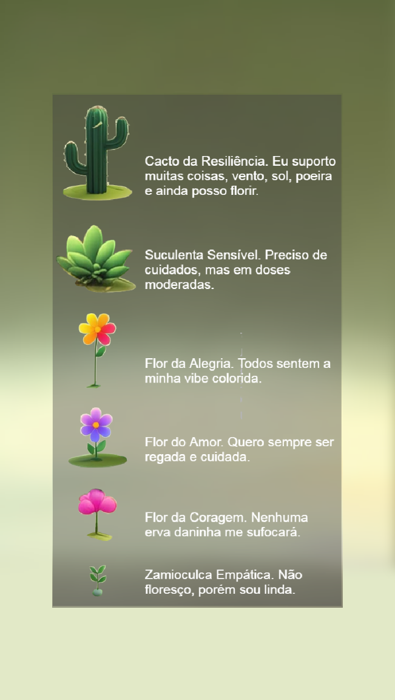
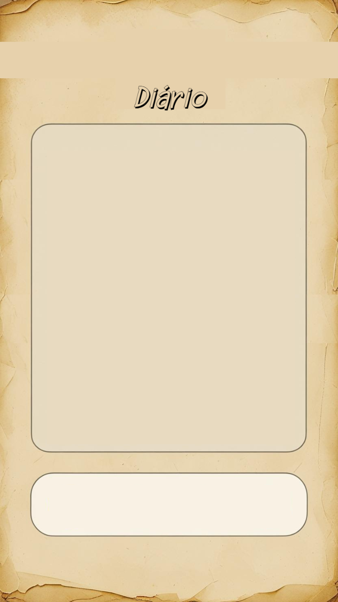
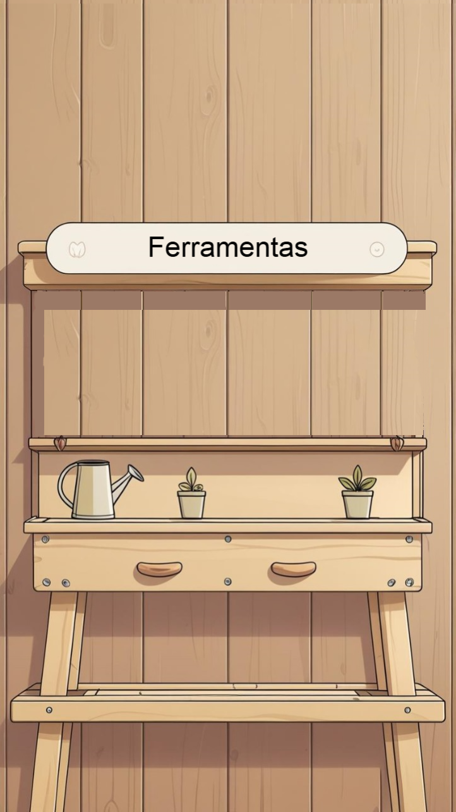

# 🌿 Jardim das Emoções

  

> **Cuide do seu jardim interior. Cuide das suas emoções.**

O **Jardim das Emoções** é um aplicativo Android de bem-estar emocional que transforma o cuidado com a saúde mental em uma experiência interativa e lúdica. Você cultiva um jardim virtual que floresce de acordo com como você se sente e cuida de si mesmo.

---

## 📱 Disponível na Play Store

---

## ✨ Funcionalidades

### 🌱 Jardim Interativo
Seu jardim virtual reflete o seu estado emocional. Quanto mais você cuida de si mesmo, mais o jardim floresce. Acompanhe o **medidor de felicidade** e veja seu jardim crescer.

### 📔 Diário Emocional
Registre seus pensamentos e sentimentos no diário integrado. Escolha como você está se sentindo:
- 😊 **Feliz**
- 😢 **Triste**
- 😤 **Estressado**
- 😴 **Cansado**

### 🛠️ Ferramentas de Cuidado
Cuide do seu jardim usando três ferramentas:
- 💧 **Regar** — hidrate seu jardim e sua alma
- ✂️ **Podar** — elimine o que não serve mais
- 🌿 **Adubar** — nutra seu crescimento pessoal

### 🧘 Conselheiro Virtual
Receba mensagens de apoio e reflexão personalizadas de acordo com sua emoção do momento. O conselheiro está sempre pronto para oferecer palavras de acolhimento.

### 🔗 Ajuda Psicológica
Acesse links diretos para profissionais e grupos de apoio à saúde mental, facilitando o contato com ajuda especializada quando você precisar.

---

## 🖼️ Telas do Aplicativo

| Apresentação | Diário | Ferramentas |
|:---:|:---:|:---:|
|  |  |  |

---

## 🚀 Como Usar

1. **Abra o aplicativo** e aguarde a tela de carregamento.
2. **Explore o seu jardim** na tela principal e verifique o medidor de felicidade.
3. **Registre seu humor** no diário tocando no botão de diário e escrevendo como está se sentindo.
4. **Selecione uma emoção** (Feliz, Triste, Estressado ou Cansado) para que o jardim e o conselheiro reajam ao seu estado.
5. **Use as ferramentas** para cuidar do jardim: regue, pode ou adube as plantas.
6. **Converse com o conselheiro** para receber mensagens motivacionais e de apoio.
7. **Busque ajuda profissional** pela tela de apresentação, se precisar de suporte psicológico.

---

## 🛡️ Privacidade

O aplicativo coleta apenas os dados necessários para o funcionamento do diário e das funcionalidades emocionais. Consulte nossa [Política de Privacidade](app/src/main/assets/privacidade.html) para mais detalhes.

---

## 🔧 Tecnologias Utilizadas

- **Android** (Java) — desenvolvimento nativo
- **WebView** — interface renderizada em HTML/CSS/JavaScript
- **Firebase** — autenticação, banco de dados em tempo real e analytics
- **AndroidX / Material Design** — componentes modernos de UI

---

## 📋 Requisitos

- Android 5.0 (Lollipop) ou superior
- Conexão com a internet (para algumas funcionalidades)

---

## 🤝 Contribuição

Contribuições são bem-vindas! Sinta-se à vontade para abrir uma *issue* ou enviar um *pull request*.

---

## 📄 Licença

Este projeto está sob licença proprietária. Todos os direitos reservados © Jardim das Emoções.

---

  Feito com 💚 para cuidar da sua saúde emocional

